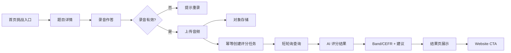
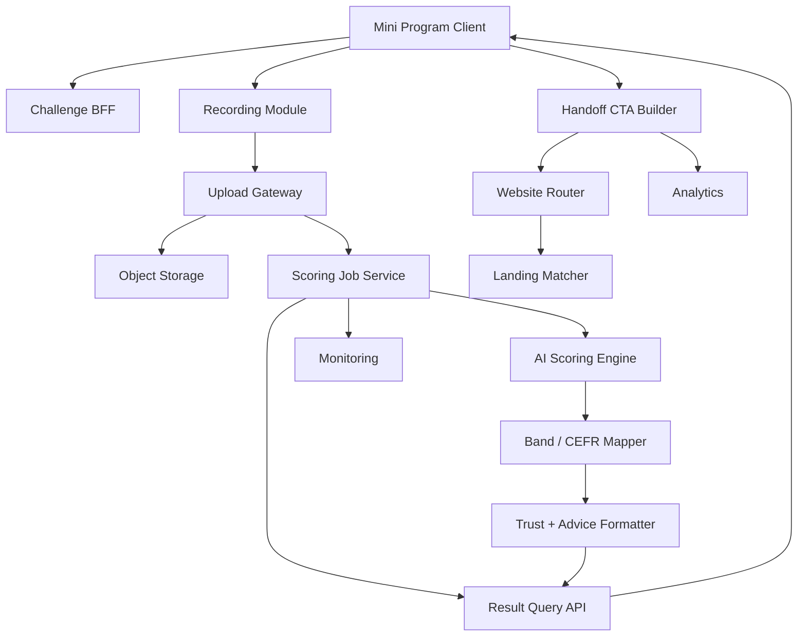

## §0 上游引用（Value Frame 摘要）

- 上游 Value：`EPIC E1 = speaking-challenge-and-scoring`
- Value status：`draft`（提示：Value Frame 尚未标记 `panel_approved`，本 Solution 可继续推进，但跨团队评审前建议 PM 确认状态）
- Phase：MVP / `mobile-speaking-challenge`
- 目标 KPI：K1、K2、K3、K6、K7、K8、K9
- value_statement：用户能在小程序内完成一次口语作答并立即拿到对齐 IELTS band 与 CEFR、含可信度说明与提分建议的评分，并被引导到 website 进一步提分。
- 约束继承：小程序为轻量口语挑战与评分入口；website 承接更全题库、更多 AI 能力、解题锦囊、提分建议和付费转化；评分结果需对齐 IELTS band 并提供 CEFR 对照解释；首期范围优先口语。
- 项目规则继承：MVP 评分链路默认短轮询；音频先上传并落对象存储，再创建评分任务；评分任务创建必须支持幂等；website 深链只透传来源场景和 score bucket；无效录音不得进入评分链路。
- 合并说明：本 brief 替代旧 E1-E4 四份独立 brief，且继承 Value 后续 refine 中并入 E1 的“提分建议”和“评分可信度 / 投诉 / 隐私 guardrail”范围。

## §1 Epic 定义

- **Epic Name**：Speaking Challenge and Scoring
- **Epic Stable ID**：`EPIC-speaking-challenge-and-scoring`
- **Context**：本 Epic 是 MVP 阶段的核心端到端价值单元，覆盖用户在小程序进入口语挑战、录音提交、AI 评分、IELTS band/CEFR 解释、可信度说明、基础提分建议和 website 导流的完整闭环。本期目标不是建设完整学习系统，而是验证移动端轻量练习到 AI 评分再到深度承接的最短价值链路。
- **Scope In**：挑战入口与题目参与、录音采集与有效性校验、音频上传与对象存储、幂等评分任务创建、短轮询结果查询、评分结果聚合、IELTS band 与 CEFR 对照解释、评分可信度说明、基础提分建议、结果页 CTA 与 website 深链导流、归因埋点、评分失败/超时恢复、隐私与投诉 guardrail。
- **Scope Out**：连续挑战、任务、提醒和留存机制（属 E2）；website 内题库、AI 工具、锦囊内容和付费承接细节（属 E3）；多科目测评入口、个性化学习路径、跨端统一学习身份（属 Future E4-E6）；完整运营数据平台。
- **Personas**：
  - `P1`：雅思备考考生，进入挑战、提交录音、查看评分并决定是否继续练习或进入 website。
  - `P2`：评分与技术运营同学，关注评分成功率、返回时长、失败恢复、投诉和隐私风险。
  - `P3`：内容/增长同学，维护题目、band/CEFR 解释口径、基础提分建议和导流承接文案。

## §2 Feature List

| Feature ID | Name | Description | Value | 预估 Story 数 | T-shirt | 关联 Persona | 主要复杂度驱动 |
|---|---|---|---|---:|:---:|---|---|
| F1 | Challenge Participation Flow | 在小程序首页、挑战列表和题目详情中提供轻量挑战入口、题目说明、作答前准备和中断恢复，让用户能在移动端低成本开始一次口语挑战。 | 降低首次参与门槛，提升挑战启动率与首次作答完成率，直接支撑 K1、K2。 | 4-6 | M | P1, P3 | 入口推荐、题目发布状态、中断恢复、无题降级 |
| F2 | Voice Scoring Pipeline | 提供麦克风授权、录音控件、无效录音拦截、音频上传、对象存储、幂等评分任务创建、短轮询查询和评分失败兜底，确保用户提交后能稳定拿到结果或恢复路径。 | 直接支撑 K1、K2、K6、K7，是用户感知 AI 测评价值和系统可靠性的核心链路。 | 6-8 | L | P1, P2 | 上传与任务分离、幂等 taskId、短轮询、超时控制、状态一致性 |
| F3 | Band-and-CEFR Result Card | 将评分服务返回的结构化结果转译成 IELTS band、CEFR 参考区间、分维度解读和基础提分建议，并在缺模板或边界分数时提供可理解的兜底解释。 | 提升结果可理解性与信任度，让用户知道自己处于什么水平以及下一步如何练习。 | 5-7 | M | P1, P3 | IELTS/CEFR 映射口径、解释模板、边界分数、建议内容治理 |
| F4 | Website Handoff CTA | 在结果页按来源场景和 score bucket 展示 website 承接入口，深链只透传低敏分层参数，并记录点击、到达和后续转化归因。 | 提升 K3 导流点击率，为 K5 付费转化提供高意向流量，同时降低敏感分数跨端扩散风险。 | 4-6 | M | P1, P3 | 跨端深链协议、默认承接降级、归因口径、score bucket 策略 |
| F5 | Scoring Trust and Guardrails | 为评分结果增加练习参考说明、可信度/限制表达、投诉反馈入口、隐私授权提示和关键埋点监控，避免用户误解为官方成绩并支持问题追踪。 | 降低 K8 投诉率和 K9 隐私事故风险，提升 AI 评分结果的可解释性和可运营性。 | 4-6 | M | P1, P2, P3 | 合规文案、投诉反馈闭环、隐私授权、监控与客服问题定位 |

## §3 User Journey

| Persona ID | Stage ID | Stage | Action | Touchpoint | Emotion |
|---|---|---|---|---|---|
| P1 | J1 | Entry | 打开小程序并看到口语挑战入口 | 首页挑战卡片 | 很快知道能做什么 |
| P1 | J2 | Prepare | 进入题目详情，查看题目、作答说明和参考性质提示 | 题目详情页 | 有目标但略紧张 |
| P1 | J3 | Action | 授权麦克风，完成录音，系统拦截空录音或过短录音 | 录音作答页 | 专注投入 |
| P1 | J4 | Submit | 提交有效录音并进入处理中状态 | 评分处理中页 | 关心是否稳定 |
| P1 | J5 | Result | 查看总分、IELTS band、CEFR 对照、分维度解读、可信度说明和基础建议 | 评分结果页 | 终于知道自己处于哪一档 |
| P1 | J6 | Decision | 选择继续练习、重新提交或进入 website 深度工具 | 结果页 CTA 区 | 判断下一步该往哪走 |
| P2 | J7 | Support | 监控评分成功率、平均返回时长、失败任务和投诉反馈 | 评分监控台 / 客服反馈入口 | 需要快速定位问题 |
| P3 | J8 | Content Ops | 维护题目、解释口径、建议模板和导流文案 | 内容配置 / 增长配置 | 希望口径稳定且可调整 |

## §4 Business Process Flow

### Happy Path

用户从首页挑战入口进入题目详情，完成麦克风授权并录制有效音频。系统先上传音频并落对象存储，再使用幂等键创建评分任务。前端进入处理中页，通过短轮询查询任务状态。评分服务返回结构化结果后，系统完成 IELTS band/CEFR 映射、可信度说明和基础建议拼装，结果页展示评分并提供 website CTA。用户点击 CTA 后，系统只透传来源场景和 score bucket 到 website，并记录完整归因事件。

### Unhappy Path 1：麦克风权限被拒绝

- 触发点：用户首次进入录音页拒绝麦克风授权。
- 关键决策点：是否引导重新授权或返回挑战页。
- 系统边界：权限申请由小程序客户端控制，授权说明和恢复路径由本系统控制。
- 异常恢复：展示权限说明和重新授权入口，禁止录音提交，保留返回题目详情和挑战列表的路径。

### Unhappy Path 2：无效录音被拦截

- 触发点：用户提交空录音、过短录音或损坏音频。
- 关键决策点：是否允许进入上传和评分链路。
- 系统边界：客户端做基础时长校验，Upload Gateway 做服务端格式和有效性校验。
- 异常恢复：提示用户重新录制，不创建评分任务，不消耗 AI 评分资源。

### Unhappy Path 3：评分超时或失败

- 触发点：评分任务超过目标时限，或 AI scoring service 返回失败。
- 关键决策点：继续等待、刷新结果、重新提交或稍后查看。
- 系统边界：Scoring Job Service 负责任务状态和超时，AI Scoring Engine 是独立依赖，结果页负责用户可感知恢复动作。
- 异常恢复：展示“结果生成较慢”或失败态，支持继续等待、刷新结果或重新提交，保留原 taskId 便于排查。

### Unhappy Path 4：映射口径或解释模板缺失

- 触发点：评分结果落在边界 band，或 CEFR / 提分建议模板缺少精确匹配。
- 关键决策点：使用通用解释模板、隐藏局部模块还是进入内容待补全状态。
- 系统边界：映射口径由 PM + Eng 确认，解释模板由内容/增长维护，展示由本系统实现。
- 异常恢复：回退到通用等级解释，并明确标注“练习参考，非官方成绩”。

### Unhappy Path 5：导流参数缺失或 website 无匹配承接页

- 触发点：结果页跳转 website 时来源场景或 score bucket 缺失，或 website 无匹配承接模块。
- 关键决策点：是否降级到默认承接页。
- 系统边界：小程序负责发参和点击归因，website 负责收参与承接降级。
- 异常恢复：进入默认承接页并记录归因缺失埋点，不出现 404 或空白页。

## §5 GWT Top 3-5

| Scenario ID | Type | Persona | Name | 关联 Stage | 关联 Feature |
|---|---|---|---|---|---|
| S1 | happy | P1 | 端到端完成挑战并拿到 band/CEFR 评分 | J1, J2, J3, J4, J5 | F1, F2, F3, F5 |
| S2 | failure | P1 | 麦克风权限被拒绝时的引导路径 | J3 | F2 |
| S3 | unhappy | P1 | 无效录音不会进入评分链路 | J3, J4 | F2, F5 |
| S4 | unhappy | P1 | 评分超时后的重试与等待路径 | J4, J5 | F2, F5 |
| S5 | happy | P1 | 结果页点击导流并进入匹配承接页 | J5, J6 | F3, F4 |

### S1：端到端完成挑战并拿到 band/CEFR 评分

GIVEN 用户已进入小程序首页
AND 当前存在已发布的口语挑战题
AND 用户已授权麦克风权限
WHEN 用户从首页挑战卡片进入题目详情并完成有效录音提交
AND 系统成功上传音频并创建幂等评分任务
AND 评分服务在目标时限内返回结构化结果
THEN 结果页展示总分、IELTS band、CEFR 参考区间、分维度解读和基础提分建议
AND 页面展示“练习参考，非官方成绩”的性质说明
AND 用户可选择继续练习或进入 website 承接入口

### S2：麦克风权限被拒绝时的引导路径

GIVEN 用户首次进入录音作答页
AND 系统已发起麦克风权限请求
WHEN 用户拒绝授权
THEN 系统展示权限说明和重新授权入口
AND 禁止用户继续录音提交
AND 页面保留返回题目详情或挑战列表的路径

### S3：无效录音不会进入评分链路

GIVEN 用户已进入录音作答页
AND 当前录音为空、过短或文件损坏
WHEN 用户尝试提交录音
THEN 系统阻止提交并提示用户重新录制
AND 系统不上传该音频到对象存储
AND 系统不创建评分任务

### S4：评分超时后的重试与等待路径

GIVEN 用户已成功提交一段有效录音
AND 系统已创建评分任务并返回 `taskId`
WHEN 评分结果在目标时限内未返回
THEN 系统展示“结果生成较慢”状态
AND 提供继续等待、刷新结果或重新提交三种动作
AND 不让用户误以为提交丢失

### S5：结果页点击导流并进入匹配承接页

GIVEN 用户已查看完一次评分结果
AND 结果页存在与当前来源场景和 score bucket 匹配的导流入口
WHEN 用户点击该入口
THEN 系统将来源场景与 score bucket 透传到 website
AND website 展示匹配的承接模块或默认承接页
AND 系统记录一次完整的导流归因事件

## §6 Phase-level Workload（T-shirt 映射）

| Feature | T-shirt | Unit Range | Effort Range | 主要复杂度驱动 |
|---|:---:|---:|---:|---|
| F1 | M | 10-20 units | 5-10 days | 入口推荐、题目状态、中断恢复、无题降级 |
| F2 | L | 20-40 units | 10-20 days | 上传与任务分离、幂等、短轮询、超时处理、状态一致性 |
| F3 | M | 10-20 units | 5-10 days | IELTS/CEFR 映射、解释模板、边界分数、建议生成 |
| F4 | M | 10-20 units | 5-10 days | 跨端深链、score bucket、归因匹配、默认承接降级 |
| F5 | M | 10-20 units | 5-10 days | 合规文案、投诉反馈、隐私授权、监控与客服定位 |
| **Epic 合计** | — | **60-120 units** | **30-60 days** | — |

## §7 Tech High-level

### 1. 架构图

**发布级图形资产（fireworks-tech-graph / Claude Official style）**：

- Layered Architecture SVG：[Project/spk2challenge-miniprogram/Solution/Engdesign/speaking-challenge-and-scoring-engdesign/speaking-challenge-and-scoring-layered-architecture.svg](../Engdesign/speaking-challenge-and-scoring-engdesign/speaking-challenge-and-scoring-layered-architecture.svg)
- Data Flow SVG：[Project/spk2challenge-miniprogram/Solution/Engdesign/speaking-challenge-and-scoring-engdesign/speaking-challenge-and-scoring-data-flow.svg](../Engdesign/speaking-challenge-and-scoring-engdesign/speaking-challenge-and-scoring-data-flow.svg)
- Sequence Happy Path SVG：[Project/spk2challenge-miniprogram/Solution/Engdesign/speaking-challenge-and-scoring-engdesign/speaking-challenge-and-scoring-sequence-happy-path.svg](../Engdesign/speaking-challenge-and-scoring-engdesign/speaking-challenge-and-scoring-sequence-happy-path.svg)
- Component Diagram SVG：[Project/spk2challenge-miniprogram/Solution/Engdesign/speaking-challenge-and-scoring-engdesign/speaking-challenge-and-scoring-component-diagram.svg](../Engdesign/speaking-challenge-and-scoring-engdesign/speaking-challenge-and-scoring-component-diagram.svg)
- Diagram Output：SVG generated；PNG export pending generation via `fireworks-tech-graph` conversion dependency (`cairosvg` / `rsvg-convert` / `puppeteer`).

### 2. 关键组件清单

| 组件 | 职责 | 归属服务 |
|---|---|---|
| Challenge Entry / Topic Detail | 展示挑战入口、题目说明、作答前提示和无题降级 | Mini Program Frontend |
| Recording Module | 麦克风授权、录音控件、时长校验、重录和提交前拦截 | Mini Program Frontend |
| Challenge BFF | 聚合题目、入口状态、用户挑战上下文和配置 | Miniapp BFF |
| Upload Gateway | 接收音频、做基础格式/有效性校验、返回对象存储引用 | API Gateway / Upload Service |
| Object Storage | 保存音频文件并执行保存周期与访问控制策略 | Storage Platform |
| Scoring Job Service | 通过幂等键创建评分任务、管理 task 状态、处理超时与失败 | Scoring Orchestrator |
| Result Query API | 支持小程序短轮询查询评分任务状态和最终结果 | Assessment BFF |
| AI Scoring Engine | 对有效录音生成总分、维度分和评分元数据 | AI Assessment Service |
| Band / CEFR Mapper | 将评分结果映射为 IELTS band 与 CEFR 参考区间 | Assessment Rule Service |
| Trust + Advice Formatter | 拼装可信度说明、练习参考声明和基础提分建议 | Content Logic Layer |
| Handoff CTA Builder | 生成 website 深链，透传来源场景和 score bucket | Shared Growth Service |
| Website Router / Landing Matcher | 接收参数并匹配题库、AI 工具或默认承接页 | Website BFF / Growth Layer |
| Attribution Tracker | 记录曝光、提交、评分成功、CTA 点击、website 到达和转化事件 | Data / Analytics |
| Ops Monitoring | 监控评分成功率、平均返回时长、失败原因、投诉和隐私风险 | Observability / Ops |

### 3. Service Interaction Flow

- 链路 1：用户进入挑战 → Challenge BFF 返回题目和挑战上下文 → Mini Program 准备录音。
- 链路 2：用户提交录音 → Recording Module 做本地有效性校验 → Upload Gateway 做服务端校验 → Object Storage 保存有效音频。
- 链路 3：Upload Gateway / Scoring Job Service 使用幂等键创建评分任务 → AI Scoring Engine 读取音频并返回结构化评分 → Band / CEFR Mapper 和 Trust + Advice Formatter 生成可展示结果。
- 链路 4：Mini Program Result Page 使用短轮询查询 Result Query API → 展示处理中、成功、超时或失败状态。
- 链路 5：用户点击 website CTA → Handoff CTA Builder 透传来源场景和 score bucket → Website Router / Landing Matcher 匹配承接模块 → Attribution Tracker 记录点击与到达。
- 链路 6：Scoring Job Service、Upload Gateway、Result Query API、Website Router 持续写入监控和归因事件 → Ops Monitoring 支持 K6、K7、K8、K9 复盘。

### 4. 主要 ADR（待研发评审确认）

- ADR-1：评分结果获取采用 callback 还是轮询，MVP 按项目规则采用短轮询，降低小程序接入复杂度并避免首版引入复杂 callback 回传。
- ADR-2：录音文件先落对象存储还是直接流式给评分服务，按项目规则采用“上传成功”和“任务创建”分离建模，便于失败排查、重试和权限控制。
- ADR-3：评分任务创建是否允许重复请求，按项目规则必须幂等，重复请求复用既有 `taskId` 或等效结果，不重复创建评分任务。
- ADR-4：website 深链是否透传原始分数，按项目规则只传来源场景和 score bucket，不透传原始敏感分数。
- ADR-5：IELTS band 与 CEFR 对照采用固定映射还是内部解释版映射，MVP 倾向固定配置 + 版本号，待 PM + Eng 确认口径后进入内容治理。
- ADR-6：音频保存周期和训练复用范围待 PM + Eng + Compliance 确认；在确认前以最小保存和明确授权为默认方向。

## §8 Story List 预览

### F1 — Challenge Participation Flow

- `EPIC-speaking-challenge-and-scoring-F1-S01` — 首页挑战入口：在首页展示当前可参与的口语挑战入口和基础说明。
- `EPIC-speaking-challenge-and-scoring-F1-S02` — 挑战列表浏览：用户进入列表查看已发布挑战题和状态。
- `EPIC-speaking-challenge-and-scoring-F1-S03` — 题目详情与开始挑战：展示题目、作答要求、参考性质说明并进入录音页。
- `EPIC-speaking-challenge-and-scoring-F1-S04` — 中断恢复：用户离开后可回到已选择题目并继续挑战。
- `EPIC-speaking-challenge-and-scoring-F1-S05` — 题目缺失降级：无可用题目时展示历史题、备用提示或返回入口。

### F2 — Voice Scoring Pipeline

- `EPIC-speaking-challenge-and-scoring-F2-S01` — 麦克风权限申请：首次进入录音页发起授权并展示用途说明。
- `EPIC-speaking-challenge-and-scoring-F2-S02` — 录音控件：支持开始、停止、试听和重录。
- `EPIC-speaking-challenge-and-scoring-F2-S03` — 无效录音校验：空录音、过短录音或损坏音频不可进入评分链路。
- `EPIC-speaking-challenge-and-scoring-F2-S04` — 音频上传与对象存储：有效音频先上传并生成可追踪文件引用。
- `EPIC-speaking-challenge-and-scoring-F2-S05` — 幂等评分任务创建：基于用户、题目和音频引用创建或复用评分任务。
- `EPIC-speaking-challenge-and-scoring-F2-S06` — 短轮询评分状态查询：前端可查询处理中、成功、失败和超时状态。
- `EPIC-speaking-challenge-and-scoring-F2-S07` — 超时与失败恢复：用户可继续等待、刷新结果或重新提交。

### F3 — Band-and-CEFR Result Card

- `EPIC-speaking-challenge-and-scoring-F3-S01` — 总分与分维度展示：结果页展示总分、维度分和基础说明。
- `EPIC-speaking-challenge-and-scoring-F3-S02` — IELTS band 与 CEFR 对照：展示当前 band 和 CEFR 参考区间。
- `EPIC-speaking-challenge-and-scoring-F3-S03` — 基础提分建议：基于分层和维度生成下一步练习建议。
- `EPIC-speaking-challenge-and-scoring-F3-S04` — 边界分数解释回退：缺少精确模板时使用通用等级解释。
- `EPIC-speaking-challenge-and-scoring-F3-S05` — 解释版本管理：结果解释记录映射版本和内容模板来源。

### F4 — Website Handoff CTA

- `EPIC-speaking-challenge-and-scoring-F4-S01` — 结果页 CTA 渲染：按来源场景和 score bucket 展示 website 入口。
- `EPIC-speaking-challenge-and-scoring-F4-S02` — 深链参数透传：只传递来源场景、score bucket 和必要归因参数。
- `EPIC-speaking-challenge-and-scoring-F4-S03` — Website 默认承接降级：缺参或无匹配承接页时进入默认承接页。
- `EPIC-speaking-challenge-and-scoring-F4-S04` — 导流归因埋点：记录结果页曝光、CTA 点击、website 到达和后续转化。

### F5 — Scoring Trust and Guardrails

- `EPIC-speaking-challenge-and-scoring-F5-S01` — 练习参考性质说明：在题目详情和结果页展示非官方成绩说明。
- `EPIC-speaking-challenge-and-scoring-F5-S02` — 隐私授权提示：录音提交前说明数据用途、保存和授权边界。
- `EPIC-speaking-challenge-and-scoring-F5-S03` — 结果可信度表达：在结果页展示 AI 评分限制、适用范围和解释口径。
- `EPIC-speaking-challenge-and-scoring-F5-S04` — 投诉与反馈入口：用户可针对评分错误、结果不可理解或页面异常提交反馈。
- `EPIC-speaking-challenge-and-scoring-F5-S05` — Guardrail 监控埋点：记录 K6、K7、K8、K9 所需的技术和业务事件。

## §9 Open Questions（含 Value 继承）

### 来自 Value Frame（继承）

| OQ ID | Question | Status | Owner |
|---|---|---|---|
| V-OQ1 | 小程序首期的挑战机制最小版本是什么：单题挑战、每日挑战、连续打卡，还是榜单竞赛 | open | PM |
| V-OQ2 | 评分结果是否直接展示完整 IELTS band descriptor 解释，还是先展示简化版结论再展开详情 | open | PM |
| V-OQ3 | IELTS band 与 CEFR 对照表采用固定映射还是内部解释版映射 | open | PM + Eng |
| V-OQ4 | website 承接页的首期目标是题库浏览、AI 工具试用，还是直接会员/产品购买转化 | open | PM |
| V-OQ5 | 语音数据的保存周期、授权提示和可复用范围如何定义 | open | PM + Eng |
| V-OQ6 | 小程序评分返回的目标时延能否稳定控制在 20 秒内 | open | Eng |
| V-OQ7 | 首期是否只覆盖指定简化题库，还是同时支持自由题目扩展 | open | PM |
| V-OQ8 | E5 personalized-study-routing 是否与 E4 multi-skill-assessment-entry 同期上线；如同期且 E4 必为 E5 提供评分数据源，则应合并为一个 Future Epic | open | PM |

### 本 Solution 新增

| OQ ID | Question | Status | Owner |
|---|---|---|---|
| S-OQ1 | 评分返回前是否允许用户离开页面并稍后查看结果 | open | PM + Eng |
| S-OQ2 | 音频存储是否需要做脱敏、分级保留或训练用途隔离 | open | Eng + Compliance |
| S-OQ3 | 小程序到 website 是否需要账号打通后再跳转，还是允许匿名承接 | open | PM + Eng |
| S-OQ4 | 承接页首版是否允许直接出现价格和购买 CTA，还是先用工具试用承接 | open | PM + Growth |
| S-OQ5 | 本 Epic 合计 60-120 units，是否在第一次研发评审拆分为里程碑迭代 | open | Eng + PM |
| S-OQ6 | 评分可信度说明是否需要 Compliance 预审固定模板 | open | Compliance + PM |

## §10 跨团队评审记录

- 待安排：PM / Eng / QA / Compliance / Growth / Content 联合评审，覆盖挑战入口、录音与评分链路、band/CEFR 解释、评分可信度、website 导流与归因。
- Eng Review 重点：短轮询间隔和超时阈值、幂等键设计、任务状态机、音频保存周期、AI scoring SLA、website 深链安全边界、K6/K7/K8/K9 监控口径。
- 图形资产：已生成 SVG 到 `Project/spk2challenge-miniprogram/Solution/Engdesign/speaking-challenge-and-scoring-engdesign/`，PNG 导出待转换依赖确认。

## §11 已沉淀规则索引

- 端到端价值链路（参与 -> 评分 -> 解释 -> 导流）必须作为单一 Epic 推进，不再按层切。
- MVP 评分链路默认采用短轮询查询结果，不在首版引入复杂 callback 回传。
- 音频先上传并落对象存储，再创建评分任务；上传成功与任务创建必须分离建模。
- 评分任务创建必须支持幂等，重复请求复用既有 `taskId` 或等效结果。
- 无效录音（空录音、过短、损坏）不得进入评分链路。
- website 深链默认透传来源场景和 score bucket，不透传原始敏感分数。
- 结果页必须展示“练习参考，非官方成绩”性质说明。
- 评分超时与失败必须给出继续等待、刷新结果或重新提交的清晰恢复路径。

## §12 变更记录

- 2026-05-08-0200：首版创建。本 brief 由旧 E1 miniapp-speaking-challenge / 旧 E2 miniapp-voice-scoring / 旧 E3 ielts-band-cefr-mapping / 旧 E4 website-handoff-entry 四份 brief 合并而成，对应 Value Frame v0000 的 §4 refine（合并为新 E1 speaking-challenge-and-scoring）。旧四份 brief 已退役，详见各 Solution 子目录的 LATEST.md。
- 2026-05-13：Refinement。同步 Value 后续合并范围，补齐 K8/K9、V-OQ8、项目规则（短轮询、上传与任务分离、幂等评分任务、score bucket 深链、无效录音拦截），新增 F5 Scoring Trust and Guardrails，并生成 `fireworks-tech-graph` Claude 风格 SVG 图形资产供 Eng Review 使用。
