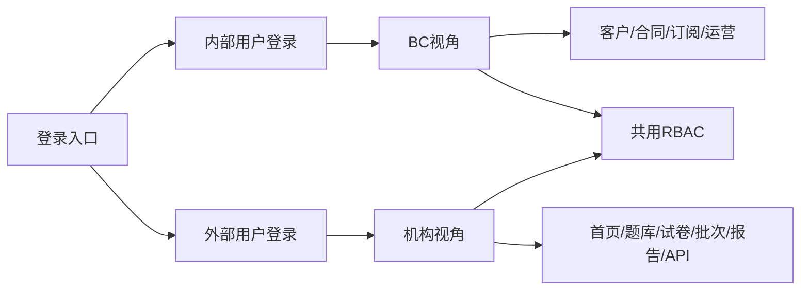
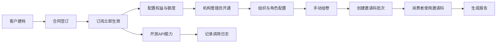

# IELTS Up B2B Platform 需求设计评审（V3更新版）

## 1. 文档目的

本文档基于 Magic Patterns 设计稿 `IELTS Up B2B Platform_v3 Zhanxi` 与当前 artifact 页面结构，重新整理系统范围、角色边界、页面拆分和交互规则，作为产品、设计、研发进入详细设计前的统一基线。

本次更新重点：

- 将 RBAC 抽离为共用能力。
- 将非共用能力拆分为：内部用户登录、外部用户登录、BC 视角、机构视角。
- 将上一版中的“待确认项”收敛为已明确业务规则。
- 按页面补齐交互细节，并明确首期范围与延后范围。

## 2. 设计来源

- 设计地址：https://www.magicpatterns.com/c/7crzvhakdvxvi6ctkha8gr/preview
- 当前 artifact：`ef69039e-e96b-40af-96bf-e7edabbb88f4`
- 设计名称：`IELTS Up B2B Platform_v3 Zhanxi`
- 当前设计特征：多页面 B2B 管理平台，覆盖 BC 内部运营和机构侧使用两类场景。

## 3. 更新结论摘要

### 3.1 共用能力结论

- 用户、机构、组织、角色维护统一归入 RBAC 共用能力。
- RBAC 作为全平台公共底座，服务 BC 侧与机构侧。
- 权限控制分为：菜单权限、页面内操作权限、数据范围权限。
- 机构侧支持管理员、助教、教师等子角色；BC 侧支持管理员和运营类角色。

### 3.2 非共用能力拆分结论

- 内部用户登录：服务 BC 内部用户，登录后进入 BC 视角。
- 外部用户登录：服务机构用户，登录后进入机构视角。
- BC 视角：负责客户、合同、订阅、额度、机构开通和内部运营管理。
- 机构视角：负责机构首页、题库、试卷、邀请码批次、报告分析、API 管理和本机构用户组织管理。

### 3.3 业务规则结论

- 客户与机构按当前一期设计按一一对应处理；一个机构维护一条联系人信息，并支持创建一个初始账号管理员。
- 合同主体支持多产品、多周期和补充协议；补充协议仅按合同整体追加，不支持按单独产品、单独周期拆分管理。
- 合同签订后订阅立即生效；无暂停逻辑，无单独“续费中”状态；合同签订时必须填写服务截止时间。
- 题目分类维度固定为：WriteUp `Task 1 / Task 2`，SpeakUp `Part 1 / Part 2&3`。
- 试卷创建方式固定为手动组卷；首期不支持规则组卷、模板组卷。
- 首期无审核状态、发布状态和版本机制。
- 外部用户视角的核心对象为批次、邀请码和邀请码消费者；消费者信息仅作为邀请码绑定信息存在，不单独抽象为机构侧“学员/班级”领域对象。
- 报告按产品线采用统一结构，不同产品仅字段内容和展示重点不同。
- 首期暂不支持机构级导出、对比分析和趋势分析。

## 4. 产品范围与角色模型

### 4.1 产品定位

该系统是一套面向雅思教育机构的 B2B 管理平台，覆盖从客户签约、机构开通、额度发放到题库管理、试卷组装、邀请码发放、消费者绑定、报告回看和 API 接入的全链路能力。

### 4.2 角色模型

#### 4.2.1 BC 内部角色

- BC 超级管理员：维护客户、订阅、额度、机构和全局权限。
- BC 运营/销售：维护客户信息、合同信息、订阅与服务周期。

#### 4.2.2 机构侧角色

- 机构管理员：维护机构用户、组织、额度使用、邀请码批次、消费者绑定信息、题库、试卷、报告与 API。
- 助教：使用邀请码批次和报告分析，维护批次内的邀请码与消费者绑定信息，通常不具备题库、试卷和高级系统管理权限。
- 教师：维护题库、试卷与报告查看，不具备批量发码和系统管理权限。

### 4.3 RBAC 共用能力

RBAC 作为共用模块，统一包含以下对象：

- 机构：租户级业务主体。
- 组织：机构或 BC 内的层级化组织节点。
- 用户：可登录账号。
- 角色：权限集合载体。
- 用户角色绑定：用户与组织、角色的关系矩阵。

RBAC 共用规则：

- 用户至少需要一个有效的“组织 + 角色”绑定。
- 角色支持复制，不支持同名重复创建。
- 删除组织前必须迁移或移除组织成员。
- 删除角色前必须解除用户绑定。
- 禁用账号后不可登录，但保留历史操作日志。

## 5. 非共用能力拆分

### 5.1 内部用户登录

服务对象：BC 内部人员。

登录特征：

- 使用企业邮箱账号密码登录。
- 支持 Microsoft 账号登录作为统一身份入口。
- 登录成功后默认进入 BC 视角首页入口页，当前设计可落到客户管理页。
- 首次登录、重置密码后应强制校验密码强度。

### 5.2 外部用户登录

服务对象：机构侧用户。

登录特征：

- 使用机构分配账号登录。
- 支持邮箱账号密码登录。
- 忘记密码、首次激活、修改密码属于外部用户自助能力。
- 登录成功后默认进入机构视角首页。

说明：当前设计中的视角切换条属于演示模式，不应作为真实生产系统的正式入口；正式环境中应通过登录身份和租户信息直接路由到对应视角。

### 5.3 BC 视角

BC 视角负责内部商业化和运营管理，模块包括：

- 客户管理
- 合同管理
- 订阅管理
- 额度明细
- 用户与组织管理
- API 调用记录

### 5.4 机构视角

机构视角面向机构管理员、助教、教师，模块包括：

- 首页与数据总览
- 订阅信息管理
- 邀请码批次管理
- 题库
- 试卷管理
- 成绩与报告
- API 管理
- 用户与组织管理
- 批次内消费者绑定信息管理

## 6. 信息架构重组

### 6.1 共用模块

- 登录
- 修改密码
- 用户与组织管理
- 角色管理

### 6.2 BC 视角模块

- 客户管理：`Customer List / Customer Detail`
- 合同管理：`Client Contract / Add Contract / Edit Contract / Manage Contract`
- 订阅管理：`Subscription List / Subscription Detail / View Entitlement / Credit Detail`
- 系统管理：`Member Management`
- 审计管理：`API Call Records`

### 6.3 机构视角模块

- 首页：`Institution Dashboard`
- 订阅信息：`Quota Overview / Usage History`
- 邀请码批次：`Pincode List / Pincode Detail / Create Pincode`
- 题库：`WriteUp Bank / SpeakUp Bank / ScoreUp Bank / Question Detail`
- 试卷：`Paper List / Paper Detail / Create Paper`
- 成绩与报告：`WriteUp Reporting / SpeakUp Reporting / Report Detail`
- API：`API Management`
- 系统管理：`Org Management / Change Password`

## 7. 核心业务对象与明确规则

### 7.1 客户、机构、组织

- 客户和机构在当前一期按一一对应处理。
- 每个机构维护一条主联系人信息，用于客户档案展示。
- 每个机构支持创建一个初始账号管理员，该管理员再基于 RBAC 继续创建其他机构用户。
- `Organization` 为机构内部层级结构，不等同于客户实体。

### 7.2 合同、订阅、额度

- 合同支持同时包含多个产品、多段服务周期。
- 合同支持补充协议，但补充协议仅按合同整体独立追加，不按单产品、单周期独立拆分。
- 合同签订时必须填写服务截止时间。
- 订阅在合同签订后立即生效。
- 首期无暂停状态。
- 首期无独立续费状态；续费按新增合同或新增服务周期处理。
- 额度、权益、Credit 均归属于订阅之下，用于支持产品发码、报告释放、接口调用等消耗场景。

### 7.3 题库、试卷、产品线

- 产品线为 `WriteUp`、`SpeakUp`、`ScoreUp`。
- WriteUp 题目分类固定为 `Task 1 / Task 2`。
- SpeakUp 题目分类固定为 `Part 1 / Part 2&3`。
- ScoreUp 当前按套题或统一配置资源理解，不纳入手动组卷主体。
- 试卷仅支持手动组卷。
- 首期无审核、发布、版本机制。

### 7.4 批次、邀请码、消费者、报告

- 外部用户视角不建立“学员”“班级”两个独立领域对象。
- 批次是外部用户视角下的核心业务容器，一个批次必须绑定产品，并在非 ScoreUp 场景下绑定试卷。
- 邀请码在批次内按数量批量生成，是最终发放给外部消费者的登录凭证。
- 消费者信息为邀请码的可选绑定信息；在学校场景下，消费者可以是学员，但系统内统一按“邀请码消费者”处理。
- 批次创建完成的邀请码通常在线下发放给对应消费者，用于登录产品 portal 端。
- 报告和使用统计以批次维度为主进行汇总，邀请码和消费者作为批次下的明细信息存在。
- 报告采用统一结构：基础信息、作答信息、评分结果、报告状态、操作记录。
- 各产品只在维度字段、评分项和展示重点上差异化。
- 首期不支持机构级导出、对比分析、趋势分析。

## 8. 核心业务流程

### 8.1 客户签约到机构开通

1. BC 创建客户。
2. BC 录入合同并填写服务截止时间。
3. 系统生成对应订阅并立即生效。
4. BC 配置产品权益与额度。
5. BC 为机构创建初始管理员账号。
6. 机构管理员登录后基于 RBAC 创建本机构用户和组织结构。

### 8.2 机构内容运营流程

1. 机构管理员或教师进入题库。
2. 手动组卷创建试卷。
3. 创建邀请码批次，绑定产品、试卷、邀请码数量、有效期和报告释放规则。
4. 机构侧按需为批次内邀请码绑定消费者信息。
5. 批次创建完成的邀请码在线下发放给对应消费者。
6. 消费者使用邀请码登录产品 portal 端并进行考试或训练。
7. 系统生成报告，机构侧按批次维度查看结果。

### 8.3 API 使用流程

1. 机构侧在 API 管理页获取接入信息。
2. 外部系统发起调用。
3. 系统记录调用日志。
4. BC 可在调用记录中进行审计和排障。

## 9. Mermaid 图示

### 9.1 访问与视角拆分图

### 9.2 业务主流程图

## 10. 页面交互设计

### 10.1 全局交互原则

- 所有列表页统一支持搜索、筛选、重置、分页、空状态。
- 高风险操作统一二次确认：删除、停用、回收、重置、生成密钥。
- 表单统一采用“实时校验 + 提交校验”。
- 提交中按钮进入 loading 态，不允许重复点击。
- 失败提示必须给出明确动作：返回修改、重新提交、联系管理员。
- 页面统一覆盖四类状态：加载中、无数据、无权限、失败重试。

### 10.2 共用页面交互

| 页面 | 交互细节 |
| --- | --- |
| 内部用户登录 | 支持邮箱账号密码登录和 Microsoft 登录；输入为空时显示即时错误；密码错误保留账号输入；登录成功后跳转 BC 视角。 |
| 外部用户登录 | 支持邮箱账号密码登录；提供忘记密码入口；首次激活用户登录后应跳转修改密码或激活流程；登录成功后跳转机构视角首页；不通过演示态视角切换条进入业务页。 |
| 修改密码 | 校验旧密码、新密码强度、确认密码一致；提交成功后提示重新登录或刷新凭证。 |
| 用户与组织 | 采用三 tab 结构：组织架构、用户管理、角色管理；tab 切换不刷新路由；各 tab 独立维护筛选条件和弹窗状态。 |
| 组织架构 tab | 左侧树，右侧详情；创建组织需选择上级；删除前必须校验无成员；一级节点默认不可删除。 |
| 用户管理 tab | 支持按用户名、邮箱、组织、角色筛选；新建用户后需配置至少一个组织角色绑定；支持启用、禁用、再次激活。 |
| 角色管理 tab | 支持新建、复制、编辑角色；权限按模块分组；删除前需校验无用户绑定；系统角色默认不可删除。 |

### 10.3 BC 视角页面交互

| 页面 | 交互细节 |
| --- | --- |
| 客户列表 | 默认按创建时间倒序；支持按集团、客户名称、创建日期筛选；搜索与重置后保留当前分页状态；列表项点击“查看详情”可进入详情抽屉或详情页；空结果需提示“未找到匹配客户”并提供清空筛选入口。 |
| 创建客户 | 通过顶部“创建客户”按钮打开弹窗；集团可选填，客户名称必填且需校验重复；联系人、备注可选；提交成功后新客户插入列表顶部并默认状态为“未签约/无生效合同”；取消关闭时若有未保存内容需二次确认。 |
| 客户详情 | 顶部展示客户名称和当前合同状态；基本信息区支持查看与编辑两种模式；详情页需聚合展示联系人、备注、合同入口、订阅入口、额度入口和后续操作；若无生效合同，应在页面头部给出弱提示但不阻断查看。 |
| 客户详情-编辑基本信息 | 仅允许编辑联系人和备注等非主键字段；进入编辑态后展示“保存/取消”；取消时回滚本次修改；保存成功后即时刷新详情卡片；若字段无变化则保存按钮置灰。 |
| 客户与合同管理 | 以客户为维度查看合同列表；列表中需直接展示合同编号、产品范围、服务截止时间、当前结果态和补充协议数量；支持从客户详情跳转新增合同、查看某合同详情或进入编辑。 |
| 新增合同 | 表单支持一次录入多个产品和多个服务周期；产品项之间独立维护起止时间、权益和额度配置；服务截止时间必填并参与合同有效性计算；提交前需校验周期不重叠、产品配置完整；提交成功后自动生成订阅并写入审计记录。 |
| 编辑合同 | 允许修改合同基础信息、服务截止时间、补充协议记录和服务范围；已生效合同的关键字段变更需弹出影响提示；保存后需要同步刷新关联订阅和额度展示；所有关键字段变更必须落审计日志。 |
| 合同管理 | 作为合同总览页展示合同编号、客户、协议版本、服务范围、截止时间和关联订阅；支持查看当前有效协议与历史协议；历史协议默认折叠展示；首期不提供复杂版本比对，仅提供时间线式查看。 |
| 订阅列表 | 支持按客户、产品、状态、服务区间筛选；状态仅展示“生效中/已到期”等结果态；可从客户侧或全局进入；列表项点击进入详情；当合同到期前临近阈值时应展示到期预警标识。 |
| 订阅详情 | 展示订阅基础信息、服务区间、产品权益、额度池、消耗入口、关联合同与历史调整记录；页面需区分可用额度、累计充值、累计消耗；若可用额度为 0，需对账号与服务操作展示限制说明。 |
| 查看权益 | 汇总当前客户在各产品线下的权益项、额度总量、已使用量和剩余量；卡片点击可联动跳转额度明细；当某产品未开通时应展示灰态并说明不可用原因。 |
| 额度充值 | 从订阅详情进入充值弹窗；充值金额采用预设档位并自动映射 Credit 数量；必须填写使用截止日期和合同/收据编号；提交前展示充值后额度变化；一份依据仅允许使用一次，避免重复入账。 |
| 额度明细 | 记录充值、扣减、回收、到期失效等流水；支持按产品、时间、变更类型筛选；列表需能看出来源单据、操作人和变更后余额；若由系统自动回收或自动过期触发，操作来源需标记为系统。 |
| 管理员账号管理 | 在订阅详情中展示机构管理员账号状态；若尚未创建管理员，提供“创建管理员”空状态入口；创建或更换管理员时需填写姓名、邮箱，并提示将发送激活邮件；未激活账号支持再次激活；停用管理员需显式展示对机构登录权限的影响。 |
| 席位管理 | 在订阅详情中展示当前开通席位数；支持新增或扩充席位；扩充场景必须填写依据说明；席位调整成功后需要即时刷新账号信息区；若当前无可用额度，则扩充动作不可执行并展示原因。 |
| 服务调整 | 在订阅详情中逐项展示 API 服务和客户端服务开通状态；点击“调整服务”进入确认弹窗；弹窗内需展示目标服务、当前状态、目标动作和原因输入；关闭已开通服务时应提示对机构侧功能可见性和调用能力的影响。 |
| BC 成员管理 | 页面能力复用 10.2 的用户与组织管理，但数据范围固定为 BC 内部；BC 管理员可维护 BC 组织树、内部账号和角色绑定；内部组织删除、角色删除、账号禁用等规则与共用 RBAC 一致。 |
| API 调用记录 | 支持按接口名称、调用时间、状态码、调用方筛选；列表展示请求时间、接口、调用方、结果、耗时与错误摘要；点击记录后可展开或进入详情查看请求上下文；异常记录需支持快速过滤 4xx/5xx；该页仅用于审计与排障，不提供重放调用。 |

### 10.4 机构视角页面交互

| 页面 | 交互细节 |
| --- | --- |
| 首页 | 首页由欢迎区、额度卡片、快捷入口和基础数据看板组成；卡片点击需跳转到对应产品或功能页；快捷入口按机构管理员、助教、教师做差异化展示。 |
| 额度总览 | 按产品展示当前有效额度、已用、剩余、到期时间和来源订阅；卡片点击可进入消耗记录；若某产品未开通则展示灰态卡片；口径必须与 BC 侧权益和额度汇总保持一致。 |
| 消耗记录 | 支持按产品、时间范围、消耗类型筛选；需同时提供列表和汇总口径说明；消耗类型至少区分发码、API 调用、报告释放等来源；若筛选结果为空，应提示“当前筛选条件下无消耗记录”。 |
| 邀请码批次列表 | 支持按产品、套餐、批次状态、创建日期筛选；点击批次编号进入详情；列表需展示总码数、已使用、未使用、报告释放方式、有效期和绑定消费者人数；进行中且存在未使用码时显示“一键回收”，否则隐藏或置灰。 |
| 邀请码批次详情 | 展示批次基础信息、绑定试卷、报告释放方式、有效期、使用统计、邀请码明细、已绑定消费者和操作记录；详情页应支持查看单个邀请码状态以及该码是否已绑定消费者；若批次已回收或已过期，需明确说明剩余码的回收去向和时间。 |
| 创建邀请码批次 | 采用“产品与余量选择 / 批次设置 / 绑定消费者”三段式表单；非 ScoreUp 必须绑定试卷；创建时必须输入本批次需要生成的邀请码数量；生成数量实时计算剩余额度并阻断超额提交；支持选择是否绑定消费者信息；提交前进入预览确认；教师角色进入该页时直接展示无权限态。 |
| 创建邀请码批次-历史批次复用 | 打开“选择历史批次”弹窗后，列表展示批次编号、批次名称、试卷和消费者数量；选择后将历史批次中的消费者绑定信息写回当前批次草稿；允许更换和取消复用；复用仅复制消费者信息，不复制旧批次的有效期、额度和邀请码状态。 |
| 创建邀请码批次-上传消费者信息 | 支持下载模板、点击上传和拖拽上传；上传后需展示识别成功的文件名与人数；允许删除已上传文件并重新上传；模板字段格式错误时应在上传后给出逐行错误提示，而不是静默失败。 |
| 创建邀请码批次-手动维护消费者信息 | 支持手动新增、编辑、删除本批次内的消费者信息；可按姓名、联系方式或外部编号检索已录入消费者；一条消费者信息最终对应一个邀请码；未绑定消费者时，邀请码保持通用状态。 |
| WriteUp 题库 | 支持按 `Task 1 / Task 2`、图表类型、主题、关键词筛选；题目列表展示题目 ID、标题和标签；点击题目进入详情；筛选条件在返回列表后应保留；若从创建试卷页进入题库选择，需与试卷当前产品类型保持一致。 |
| SpeakUp 题库 | 支持按 `Part 1 / Part 2 / Part 3` 与关键词筛选；题目列表展示题目 ID、Part 类型和主题标签；点击题目进入详情；在创建试卷场景下需要对超出结构约束的题目显示禁用态。 |
| ScoreUp 题库 | 以套题或资源包维度展示内容；当前仅支持查看，不参与手动组卷主流程；若某资源尚未开通，应给出只读提示。 |
| 题目详情 | 展示题干、题目 ID、标签、适用产品、更新时间和必要说明；返回上一页需保留原筛选条件和滚动位置；若由试卷详情或试卷创建页跳转进入，返回时应回到原上下文。 |
| 试卷列表 | 支持按试卷名称、产品类型、状态筛选；列表展示题目数量、创建人、创建时间和启停状态；管理员与教师均可查看详情，但停用动作需按角色和创建人约束；空态时提供“创建试卷”入口。 |
| 创建试卷 | 仅支持手动组卷；页面分为基本信息、题库选择、已选题目三块；产品切换时清空已选题并重置筛选；WriteUp 需按 Task 逻辑选题，SpeakUp 需满足 `3 道 Part 1 + 1 道 Part 2` 的结构校验；支持拖拽调整题目顺序；未通过结构校验时保存按钮不可用。 |
| 试卷详情 | 展示试卷基础信息和题目列表；题目列表支持跳转题目详情；正常状态下可执行停用，停用后不可用于新批次；已绑定到历史批次的试卷被停用后，不影响已存在批次。 |
| 邀请码消费者信息 | 消费者信息不作为机构侧独立页面存在，而是作为批次创建和批次详情中的内嵌能力维护；字段可包括姓名、联系方式、外部编号、备注等；消费者是否为“学员”取决于线下业务场景，但系统中统一按消费者处理。 |
| 机构侧组织管理 | 页面能力复用 10.2 的用户与组织管理；机构管理员可维护本机构组织树、成员和角色绑定；助教和教师通常仅有查看或有限编辑权限；所有机构侧操作均受租户数据范围限制。 |
| 修改密码 | 页面能力复用 10.2 修改密码规则；外部用户从个人入口进入；修改成功后需提示重新登录或刷新凭证；连续失败应提示检查旧密码是否正确。 |
| WriteUp 报告分析 | 支持按批次、邀请码消费者、写作题目、分数、创建时间筛选；报告页按批次分析视图呈现；表格中展示写作状态、分类、题型、话题、报告释放状态和最近作答时间；首期不支持导出、趋势对比和跨批次对比下载。 |
| SpeakUp 报告分析 | 与 WriteUp 保持统一结构，但字段换为口语题目、Part 分类和口语状态；报告页按批次分析视图呈现；报告释放状态仅在已生成报告时展示。 |
| 批次分析视图 | WriteUp 与 SpeakUp 的批次分析支持按批次号、批次名称、创建人、创建时间筛选；用户勾选多个批次后可生成对比分析；分析页展示批次总览卡、维度雷达图、维度柱状图、分数分布和自动结论；统计口径以批次为主，邀请码与消费者作为明细下钻维度。 |
| 报告详情 | WriteUp、SpeakUp、ScoreUp 报告详情统一采用“基础信息 + 作答结果 + 评分项 + 报告状态 + 释放记录”结构；若当前批次配置为手动释放，则详情页需展示“释放报告”高风险操作并二次确认；已释放报告需展示释放时间和操作人。 |
| API 管理 | 按产品展示 API Key、Secret、Endpoint 和创建时间；敏感信息默认脱敏展示，可单独显隐和复制；查看文档链接需跳转接口说明；重置 Key/Secret 为高风险动作，必须弹出确认框并明确提示旧密钥立即失效；页面底部需持续提示敏感信息保密要求。 |

## 11. 关键页面详细流程

### 11.1 创建试卷流程

1. 从试卷列表点击“创建试卷”。
2. 选择产品类型。
3. 输入试卷名称。
4. 从左侧题库筛选题目并加入右侧已选区。
5. 拖拽调整题目顺序。
6. 通过结构校验后保存。
7. 保存成功后返回试卷列表。

关键规则：

- WriteUp 题目必须从 `Task 1 / Task 2` 中手动选择。
- SpeakUp 必须满足 `3 道 Part 1 + 1 道 Part 2&3`。
- 不支持规则组卷、模板组卷。
- 不支持审核、发布、版本流程。

### 11.2 创建邀请码批次流程

1. 选择产品和套餐。
2. 读取可用余量和来源订阅。
3. 非 ScoreUp 产品必须绑定试卷。
4. 输入生成数量，实时计算剩余余量。
5. 选择报告释放机制。
6. 设置有效期。
7. 选择是否绑定消费者信息。
8. 若需要绑定，则录入或导入本批次对应的消费者信息。
9. 进入预览确认。
10. 确认后创建批次并回到列表页。

### 11.3 合同签订与订阅生效流程

1. BC 创建客户或选择已有客户。
2. 新增合同并填写服务截止时间。
3. 在合同中配置多个产品和多个周期。
4. 保存合同后自动生成生效中的订阅。
5. 系统同步生成可分配权益和额度。

### 11.4 报告查看流程

1. 机构用户进入产品线报告页。
2. 按批次、邀请码消费者、状态、时间筛选。
3. 点击某条记录进入报告详情。
4. 查看基础信息、评分项、状态和释放记录。
5. 若配置为手动释放，则执行二次确认后释放。

## 12. 状态定义

| 状态维度 | 状态值 | 判定规则 |
| --- | --- | --- |
| 合同状态 | 草稿 | 尚未确认签订 |
| 合同状态 | 已生效 | 合同已签订且未超过服务截止时间 |
| 合同状态 | 已结束 | 超过服务截止时间 |
| 订阅状态 | 生效中 | 合同签订后自动进入生效中 |
| 订阅状态 | 已到期 | 超过服务截止时间 |
| credit状态 | 有效 | 未超过有效期 |
| credit状态 | 已过期 | 超过有效期 |
| 批次状态 | 待生效 | 未达到批次生效时间 |
| 批次状态 | 进行中 | 达到生效时间且未超过失效时间 |
| 批次状态 | 已过期 | 超过失效时间 |
| 批次状态 | 已回收 | 未使用邀请码已被回收 |
| 邀请码状态 | 未使用 | 尚未登录或尚未激活 |
| 邀请码状态 | 已使用 | 登录即视为已使用 |
| 作答状态 | 未完成 | 未提交 |
| 作答状态 | 已完成 | 已提交或系统完成考试 |
| 作答状态 | 报告生成中 | 已完成但报告尚未产出 |
| 报告状态 | 未释放 | 报告已生成但未对外释放 |
| 报告状态 | 已释放 | 报告已对客户端展示 |
| 用户账号状态 | 启用 | 用户具备登录资格 |
| 用户账号状态 | 禁用 | 用户不可登录 |
| 用户激活状态 | 未激活 | 首次账号创建后尚未激活 |
| 用户激活状态 | 已激活 | 已完成首次激活并可正常登录 |

## 13. 项目更新说明

本次文档相对上一版的更新点如下：

1. 将“用户、机构、组织、角色维护”从业务模块中抽出，定义为全平台共用 RBAC 能力。
2. 将非共用部分重组为“内部用户登录、外部用户登录、BC 视角、机构视角”四块，避免继续混用演示视角和实际业务视角。
3. 将以下事项从“建议明确”升级为“已明确规则”：
	 - 客户与机构一一对应。
	 - 合同支持多产品、多周期和补充协议，但补充协议不做单产品单周期拆分。
	 - 订阅签约即生效，无暂停逻辑。
	 - 试卷仅支持手动组卷。
	 - 首期无审核、发布、版本机制。
	 - 外部用户视角按“批次-邀请码-邀请码消费者”模型组织数据。
	 - 报告结构统一。
	 - 首期不支持机构级导出、对比分析、趋势分析。
4. 补充了 BC 侧、机构侧和共用页面的交互规则，形成可进入字段级 PRD 的页面基线。

## 14. 风险与实现关注点

### 14.1 权限与数据范围风险

RBAC 虽已被定义为共用能力，但若菜单权限、操作权限、数据范围权限未同步落表，后续前后端联调仍会反复。

### 14.2 合同与订阅模型风险

合同支持多产品、多周期和补充协议，会直接影响订阅、额度和有效期的建模方式，建议先完成领域模型评审再进入开发。

### 14.3 消费者绑定模型风险

当前外部用户视角以“批次-邀请码-邀请码消费者”为主模型，适合首期上线；若后期需要面向学校场景沉淀独立学员档案、班级编排、跨批次追踪，需要再新增独立领域模型，而不应直接复用当前消费者绑定信息。

### 14.4 报告统一结构风险

统一结构可以降低开发成本，但必须先统一各产品的基础字段、状态机和操作动作，否则页面结构统一但数据含义不统一。

## 15. 建议下一步产出

1. 输出角色权限矩阵表，至少覆盖 BC 管理员、BC 运营、机构管理员、助教、教师五类角色。
2. 输出客户、机构、合同、订阅、额度、批次、邀请码的实体关系图。
3. 输出“合同签订即生效”的订阅状态流转图。
4. 输出试卷手动组卷字段级 PRD。
5. 输出邀请码批次创建和报告释放的接口时序图。
